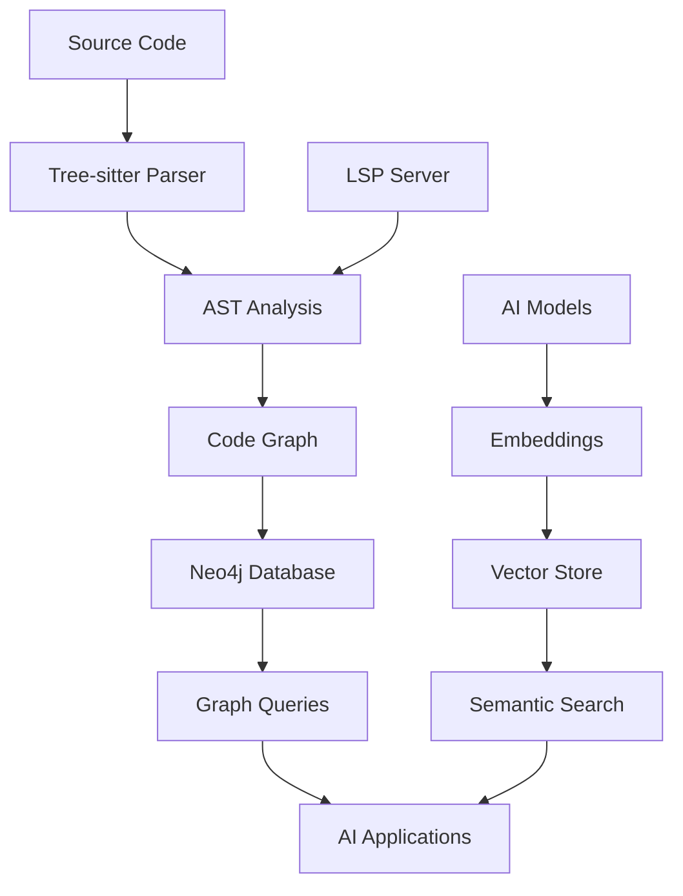

# 🔍 CodeLens AI - Intelligent Code Analysis & Relationship Mapping

> **AI-powered code understanding through advanced AST analysis and graph-based relationship mapping**

[](https://tree-sitter.github.io/tree-sitter/)
[](https://neo4j.com/)
[](https://www.typescriptlang.org/)
[](https://langchain.com/)

## 🎯 Overview

CodeLens AI is a sophisticated code intelligence platform that extracts, analyzes, and maps relationships in JavaScript/TypeScript codebases. By combining Tree-sitter AST parsing, Language Server Protocol (LSP) integration, and Neo4j graph database storage, it creates a comprehensive understanding of code structure, dependencies, and relationships for AI-powered development tools.

## ✨ Key Features

### 🧠 **Advanced Code Analysis**
- **AST-Powered Parsing** - Tree-sitter for robust, incremental code parsing
- **Semantic Relationship Mapping** - LSP integration for precise type and call analysis
- **Graph-Based Storage** - Neo4j for complex relationship queries and graph analytics
- **AI-Ready Knowledge Graphs** - Structured data for LLM integration and code understanding

### 🔧 **Comprehensive Entity Extraction**
- **Function Analysis** - Signatures, parameters, return types, call relationships
- **Class Hierarchy Mapping** - Inheritance chains, method definitions, member analysis
- **Import/Export Tracking** - Complete dependency graphs with precise positioning
- **Variable Scope Analysis** - Declaration tracking and usage patterns
- **Call Graph Generation** - Function call relationships with LSP-powered accuracy

### 🤖 **AI & ML Integration**
- **LangChain Integration** - Support for OpenAI, Anthropic, Google, and Mistral models
- **Vector Embeddings** - Code semantic search and similarity analysis
- **Graph Embeddings** - Node and relationship embeddings for ML applications
- **Supabase Integration** - Vector storage and retrieval for large-scale deployments

### 🌐 **Multi-Language Support**
- JavaScript (ES5, ES6+, JSX)
- TypeScript (with full type information)
- Extensible architecture for additional languages

## 🏗️ Architecture

### **System Overview**


### **Core Components**

#### **1. Extraction Layer** (`src/extractor/`)
- **`ModuleLevelExtractor`**: Comprehensive import/export relationship analysis
- **`FunctionExtractor`**: Function definitions with signatures and complexity analysis
- **`ClassExtractor`**: Class hierarchies, inheritance, and member relationships
- **`CallExtractor`**: LSP-powered function call relationship mapping
- **`VariableExtractor`**: Variable declarations and scope tracking
- **`ImportExtractor`**: Module dependency mapping with precise positioning

#### **2. Analysis Engine** (`src/analyser/`)
- **`CodeAnalyzer`**: Main orchestrator for multi-file analysis
- **Repository Cloning**: Git integration for remote repository analysis
- **Batch Processing**: Efficient handling of large codebases
- **LSP Integration**: TypeScript Language Server for semantic analysis

#### **3. Storage & Indexing** (`src/indexer/`, `src/db/`)
- **`Neo4jClient`**: Graph database operations and relationship storage
- **`GraphEmbedding`**: Node and relationship embedding generation
- **`NodeInference`**: AI-powered node classification and enhancement
- **`CodeVectorStore`**: Vector storage for semantic code search

#### **4. AI Integration** (`src/langchain/`, `src/inference/`)
- **Multi-Model Support**: OpenAI GPT, Anthropic Claude, Google Gemini, Mistral
- **Graph-Cypher Service**: AI-powered graph query generation
- **Embedding Services**: Code and documentation embedding generation
- **Inference Pipeline**: Automated code understanding and classification

#### **5. Query System** (`src/queries/`)
- **Tree-sitter Queries**: AST pattern matching for code entities
- **Cypher Queries**: Neo4j graph database queries for relationships
- **GraphQL Integration**: Structured API for code relationship queries

## 🚀 Quick Start

### **Prerequisites**
- Node.js 18.0.0 or higher
- Docker (for Neo4j database)
- Git (for repository cloning)

### **Installation**
```bash
# Clone the repository
git clone https://github.com/marvikomo/code-lens-aI.git
cd code-lens-aI

# Install dependencies
npm install

# Set up environment variables
cp .env.example .env
```

### **Environment Configuration**
```bash
# Neo4j Database Configuration
NEO4J_URI=neo4j://localhost:7687
NEO4J_USER=neo4j
NEO4J_PASSWORD=your-secure-password

# AI Model Configuration (optional)
OPENAI_API_KEY=your-openai-api-key
SUPABASE_URL=your-supabase-url
SUPABASE_KEY=your-supabase-key
```

### **Database Setup**
```bash
# Start Neo4j with Docker
npm run neo4j:start

# Or use Docker Compose for full stack
npm run docker:up
```

### **Basic Usage**
```bash
# Analyze a local directory
npm run analyze

# Run in development mode
npm run dev

# Run tests
npm test
```

### **Programmatic Usage**
```typescript
import { CodeAnalyzer } from './src/analyser/analyser'
import { LanguageRegistry } from './src/languages/language-registry'

// Initialize analyzer
const neo4jConfig = {
  uri: 'neo4j://localhost:7687',
  username: 'neo4j',
  password: 'password'
}

const languageRegistry = new LanguageRegistry()
const analyzer = new CodeAnalyzer(neo4jConfig, languageRegistry)

// Analyze a codebase
await analyzer.analyze('./src', {
  ignoreDirs: ['node_modules', '.git'],
  ignoreFiles: ['package-lock.json']
})

// Clone and analyze remote repository
await analyzer.cloneRepo('https://github.com/user/repo.git', './repo')
await analyzer.analyze('./repo')
```

## 📊 Supported Code Patterns

### **Import/Export Analysis**
```javascript
// ES6 Imports - All patterns supported
import React, { useState, useEffect } from 'react'
import * as utils from './utils'
import type { User } from './types'
import('./dynamic-module').then(module => {})

// CommonJS - Complete support
const { readFile, writeFile } = require('fs')
const express = require('express')
const { parse } = require('url').parse

// Export Analysis
export { default } from './component'
export const API_URL = 'https://api.example.com'
export default class MyClass {}
```

### **Function & Class Analysis**
```typescript
// Function analysis with full signature extraction
async function processUserData(
  users: User[], 
  options: ProcessingOptions = {}
): Promise<ProcessedUser[]> {
  // Call relationship tracking
  const results = await Promise.all(
    users.map(user => transformUser(user, options))
  )
  return results.filter(isValidUser)
}

// Class hierarchy analysis
class UserService extends BaseService implements IUserService {
  private apiClient: ApiClient
  
  constructor(config: ServiceConfig) {
    super(config)
    this.apiClient = new ApiClient(config)
  }
  
  async getUser(id: string): Promise<User> {
    return this.apiClient.get(`/users/${id}`)
  }
}
```

## 🔍 Analysis Capabilities

### **Code Entity Extraction**
| Entity Type | Extracted Information | Relationships |
|-------------|----------------------|---------------|
| **Functions** | Signature, parameters, return types, complexity | Calls, called-by, defined-in |
| **Classes** | Members, inheritance, interfaces | Extends, implements, contains |
| **Variables** | Type, scope, usage patterns | References, assigned-by |
| **Imports/Exports** | Source, targets, type (default/named) | Depends-on, provides |
| **Modules** | Dependencies, exports, file structure | Contains, imports-from |

### **Relationship Analysis**
- **Call Graphs**: Function-to-function call relationships
- **Dependency Trees**: Module import/export relationships
- **Inheritance Chains**: Class hierarchy mapping
- **Cross-References**: Variable and function usage across files

### **AI-Enhanced Features**
- **Semantic Similarity**: Vector-based code similarity search
- **Code Classification**: AI-powered categorization of functions and classes
- **Documentation Generation**: Automated code documentation from analysis
- **Refactoring Suggestions**: AI-driven code improvement recommendations

## 🛠️ API Reference

### **CodeAnalyzer Class**
```typescript
class CodeAnalyzer {
  // Repository operations
  async cloneRepo(repoUrl: string, targetPath: string): Promise<void>
  
  // Analysis operations
  async analyze(directory: string, options?: AnalysisOptions): Promise<void>
  async analyzeFile(filePath: string): Promise<ParsedFile>
  
  // Query operations
  getFunctions(filePath?: string): FunctionNode[]
  getClasses(filePath?: string): ClassNode[]
  getCallRelationships(): CallRelationship[]
}
```

### **Neo4j Integration**
```typescript
class Neo4jClient {
  // Node operations
  async upsertNode(nodeData: any): Promise<void>
  async query(cypher: string, params?: any): Promise<any[]>
  
  // Schema operations
  async getSchema(): Promise<DatabaseSchema>
  async initializeSchema(): Promise<void>
}
```

### **AI Integration**
```typescript
class NodeInference {
  // AI-powered analysis
  async analyzeNode(nodeData: any): Promise<EnhancedNode>
  async generateEmbedding(code: string): Promise<number[]>
  async classifyFunction(functionNode: FunctionNode): Promise<Classification>
}
```

## 🧪 Testing

### **Test Suite**
The project includes comprehensive tests covering:
- **21 Import Pattern Tests**: All JavaScript/TypeScript import variations
- **Function Analysis Tests**: Signature extraction and call relationship mapping
- **Class Hierarchy Tests**: Inheritance and member analysis
- **Integration Tests**: End-to-end analysis workflows

### **Running Tests**
```bash
# Run all tests
npm test

# Run specific test suite
npm test -- src/extractor/__tests__/module-level-extractor.test.ts

# Watch mode for development
npm run test:watch

# Coverage analysis
npm test -- --coverage
```

### **Test Coverage Areas**
- ES6 Imports (default, named, namespace, mixed, side-effect)
- CommonJS Patterns (require, destructuring, property access)
- Dynamic Imports (basic and async patterns)
- Function Call Analysis (direct, indirect, method calls)
- Class Member Analysis (methods, properties, inheritance)

## 🎯 Use Cases & Applications

### **For AI Development**
- **Code Copilots**: Enhanced AI assistants with deep code understanding
- **Automated Refactoring**: AI-driven code transformation and optimization
- **Intelligent Code Review**: Automated analysis of code changes and impact
- **Documentation Generation**: AI-powered documentation from code relationships

### **For Development Teams**
- **Code Navigation**: Understand complex codebases quickly
- **Dependency Analysis**: Track module dependencies and circular references
- **Impact Analysis**: Understand the effects of code changes
- **Architecture Visualization**: Graph-based codebase visualization

### **For DevOps & Architecture**
- **Dependency Mapping**: Visualize and analyze system dependencies
- **Bundle Optimization**: Code splitting and tree shaking insights
- **Performance Analysis**: Identify bottlenecks through call graph analysis
- **Security Auditing**: Track data flow and potential vulnerability paths

## ⚙️ Configuration

### **Analysis Configuration**
```typescript
// Analysis options
const analysisOptions = {
  // File patterns
  ignoreDirs: ['node_modules', '.git', 'dist'],
  ignoreFiles: ['*.test.js', '*.spec.ts'],
  
  // Analysis depth
  maxCallDepth: 10,
  enableComplexityAnalysis: true,
  enableTypeInference: true,
  
  // AI features
  enableEmbeddings: true,
  enableInference: true,
  
  // Performance
  batchSize: 1000,
  enableCaching: true
}
```

### **Neo4j Configuration**
```typescript
const neo4jConfig = {
  uri: 'neo4j://localhost:7687',
  username: 'neo4j',
  password: 'password',
  database: 'neo4j', // Optional: specific database
  maxPoolSize: 50,
  connectionTimeout: 30000
}
```

### **AI Model Configuration**
```typescript
// Multi-provider AI configuration
const aiConfig = {
  openai: {
    apiKey: process.env.OPENAI_API_KEY,
    model: 'gpt-4-turbo-preview'
  },
  anthropic: {
    apiKey: process.env.ANTHROPIC_API_KEY,
    model: 'claude-3-opus-20240229'
  },
  google: {
    apiKey: process.env.GOOGLE_AI_API_KEY,
    model: 'gemini-pro'
  }
}
```

## 📈 Performance & Scalability

### **Performance Metrics**
- **Large Codebase** (50k+ files): ~15-30 minutes full analysis
- **Medium Project** (5k files): ~2-5 minutes analysis
- **Incremental Updates**: Sub-second for individual file changes
- **Memory Usage**: ~2-4GB for 100k+ functions in graph

### **Optimization Features**
- **Incremental Analysis**: Process only changed files
- **Batch Processing**: Efficient database operations
- **Connection Pooling**: Optimized database connections
- **Caching System**: In-memory caching for frequent queries
- **Parallel Processing**: Multi-threaded analysis for large codebases

### **Scalability Considerations**
- **Horizontal Scaling**: Multiple analyzer instances
- **Database Sharding**: Neo4j cluster support
- **Vector Store**: Supabase for large-scale embeddings
- **Queue Systems**: Background processing for large repositories

## 🔧 Development & Contributing

### **Development Setup**
```bash
# Install development dependencies
npm install --include=dev

# Run in development mode with hot reload
npm run dev

# Build the project
npm run build

# Run linting and formatting
npm run lint
npm run format
```

### **Project Structure**
```
src/
├── analyser/           # Main analysis engine
├── extractor/          # Code entity extractors
├── db/                 # Database clients and schema
├── indexer/            # AI indexing and embeddings
├── langchain/          # AI model integration
├── language-server/    # LSP integration
├── queries/            # Tree-sitter and Cypher queries
├── util/               # Utilities and helpers
├── vector-store/       # Vector storage and search
└── interfaces/         # TypeScript type definitions
```

### **Contributing Guidelines**
1. **Fork the repository** and create a feature branch
2. **Write comprehensive tests** for new functionality
3. **Follow TypeScript best practices** and existing code style
4. **Update documentation** for any API changes or new features
5. **Ensure all tests pass** before submitting PR
6. **Add meaningful commit messages** following conventional commits

### **Code Style**
- Use TypeScript strict mode
- Follow ESLint and Prettier configurations
- Write JSDoc comments for public APIs
- Include unit tests for all new features
- Maintain backward compatibility when possible

## 🤝 Community & Support

### **Getting Help**
- **GitHub Issues**: Bug reports and feature requests
- **Discussions**: Community questions and use cases
- **Documentation**: Comprehensive guides and API reference
- **Examples**: Sample projects and integration guides

### **Contributing**
We welcome contributions from the community! Areas where help is needed:
- Additional language support (Python, Go, Rust)
- Performance optimizations
- AI model integrations
- Documentation improvements
- Example applications and use cases

## 📄 License

This project is licensed under the MIT License - see the [LICENSE](LICENSE) file for details.

## 🙏 Acknowledgments

- **Tree-sitter** team for the robust incremental parsing system
- **Neo4j** team for the powerful graph database platform
- **LangChain** community for AI integration framework
- **TypeScript** team for excellent language tooling and LSP support
- **Open source community** for inspiration, feedback, and contributions

---

## 🔗 Related Projects & Integrations

- **[Tree-sitter](https://tree-sitter.github.io/)** - Incremental parsing system for syntax highlighting and code analysis
- **[Neo4j](https://neo4j.com/)** - Leading graph database for connected data applications
- **[LangChain](https://langchain.com/)** - Framework for building AI applications with large language models
- **[TypeScript Language Server](https://github.com/typescript-language-server/typescript-language-server)** - Language Server Protocol implementation for TypeScript
- **[Supabase](https://supabase.com/)** - Open source alternative to Firebase with vector support

---

**Built with ❤️ for better code understanding and AI-powered development experiences.**

*For questions, issues, or contributions, please visit our [GitHub repository](https://github.com/marvikomo/code-lens-aI).*
